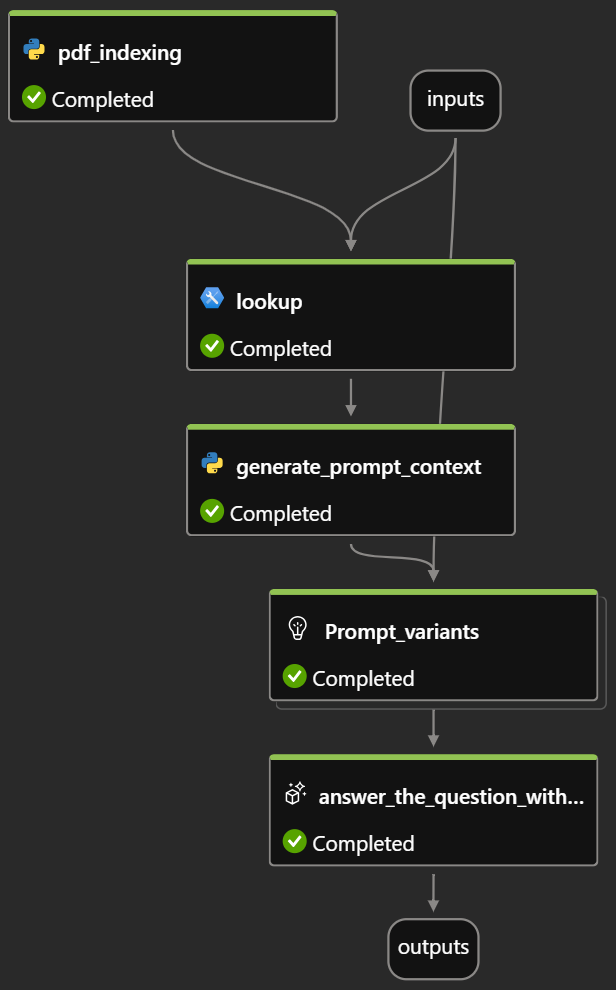

# <ins>Data Indexing Flow</ins>

### <ins>General Information</ins>
This project evaluates the latest GPT models and different indexing methods for technical PDFs in order to determine the most efficient solution and configuration. The focus here is primarily on tables within these PDFs.
For this project mainly [Azure AIs](https://azure.microsoft.com/de-de/products/ai-studio/) promptflow was used.  

### <ins>Project Structure</ins>
- `pdf_indexing.py`: Python script for indexing and extracting data from PDF documents within promptflow.
- `data-indexing.ipynb`: Jupyter notebook for data indexing and initial analyses.
- `flow.dag.yaml`: Defines the workflow and the various nodes of the RAG flow within promptflow.
- `requirements.txt`: List of the required Python packages.  
- `./example_pdfs`: Contains freely accessible, technical PDFs that were used for the evaluation.
- `./example_pdfs/question-answers.jsonl`: Questions and answers which were used to evaluate our promptflow pipeline
- `./results`: Contains the results of `data-indexing.ipynb`.

The resulting workflow within promptflow has the following structure:  

Make sure that all .env variables are set correctly (both in a separate `credentials.env` and within the `flow.dag.yaml` and the `pdf_indexing.py`)  

### <ins>Results</ins>
The results of this project show which GPT model and which index method deliver the best results. The results are listed below. The individual configurations were each run 5 times and the mean value and standard deviation of the configuration were calculated.

##### Results for GPT-4:
<table>
  <tr>
    <th></th>
    <th></th>
    <th colspan="3"><ins>Lookup Index (Default)</ins></th>
    <th></th>
    <th colspan="3"><ins>Document Intelligence</ins></th>
  </tr>
  <tr>
    <th></th>
    <th align="left">Metric</th>
    <th>Variant 0</th>
    <th>Variant 1</th>
    <th>Variant 2</th>
    <th></th>
    <th>Variant 0</th>
    <th>Variant 1</th>
    <th>Variant 2</th>
  </tr>
  <tr>
    <td></td>
    <td style="text-align:left"><b>Coherence</b></td>
    <td style="text-align:center">5.0 ± 0.0</td>
    <td style="text-align:center">5.0 ± 0.0</td>
    <td style="text-align:center">5.0 ± 0.0</td>
    <td></td>
    <td style="text-align:center">5.0 ± 0.0</td>
    <td style="text-align:center">5.0 ± 0.0</td>
    <td style="text-align:center">5.0 ± 0.0</td>
  </tr>
  <tr>
    <td></td>
    <td style="text-align:left"><b>Similarity</b></td>
    <td style="text-align:center">3.89 ± 0.04</td>
    <td style="text-align:center">3.89 ± 0.04</td>
    <td style="text-align:center">3.92 ± 0.0</td>
    <td></td>
    <td style="text-align:center">3.85 ± 0.61</td>
    <td style="text-align:center">4.43 ± 0.42</td>
    <td style="text-align:center">3.91 ± 0.65</td>
  </tr>
  <tr>
    <td></td>
    <td style="text-align:left"><b>Fluency</b></td>
    <td style="text-align:center">4.92 ± 0.0</td>
    <td style="text-align:center">4.92 ± 0.07</td>
    <td style="text-align:center">4.96 ± 0.04</td>
    <td></td>
    <td style="text-align:center">4.86 ± 0.11</td>
    <td style="text-align:center">5.0 ± 0.0</td>
    <td style="text-align:center">5.0 ± 0.0</td>
  </tr>
</table>

 

##### Results for GPT-4o:
<table>
  <tr>
    <th></th>
    <th></th>
    <th colspan="3"><ins>Lookup Index (Default)</ins></th>
    <th></th>
    <th colspan="3"><ins>Document Intelligence</ins></th>
  </tr>
  <tr>
    <th></th>
    <th align="left">Metric</th>
    <th>Variant 0</th>
    <th>Variant 1</th>
    <th>Variant 2</th>
    <th></th>
    <th>Variant 0</th>
    <th>Variant 1</th>
    <th>Variant 2</th>
  </tr>
  <tr>
    <td></td>
    <td style="text-align:left"><b>Coherence</b></td>
    <td style="text-align:center">3.59 ± 0.2</td>
    <td style="text-align:center">3.46 ± 0.09</td>
    <td style="text-align:center">3.38 ± 0.23</td>
    <td></td>
    <td style="text-align:center">3.42 ± 0.42</td>
    <td style="text-align:center">3.42 ± 0.18</td>
    <td style="text-align:center">3.26 ± 0.06</td>
  </tr>
  <tr>
    <td></td>
    <td style="text-align:left"><b>Similarity</b></td>
    <td style="text-align:center">3.67 ± 0.3</td>
    <td style="text-align:center">3.83 ± 0.25</td>
    <td style="text-align:center">3.82 ± 0.19</td>
    <td></td>
    <td style="text-align:center">2.71 ± 1.21</td>
    <td style="text-align:center">3.58 ± 0.42</td>
    <td style="text-align:center">3.24 ± 0.44</td>
  </tr>
  <tr>
    <td></td>
    <td style="text-align:left"><b>Fluency</b></td>
    <td style="text-align:center">4.64 ± 0.03</td>
    <td style="text-align:center">4.66 ± 0.01</td>
    <td style="text-align:center">4.77 ± 0.16</td>
    <td></td>
    <td style="text-align:center">4.33 ± 0.94</td>
    <td style="text-align:center">4.61 ± 0.34</td>
    <td style="text-align:center">3.94 ± 0.27</td>
  </tr>
</table>
